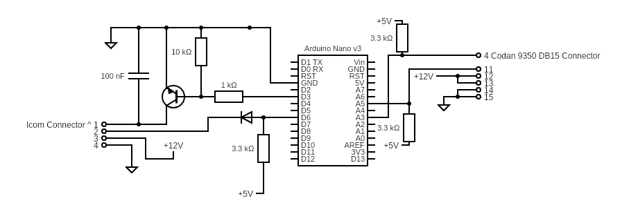
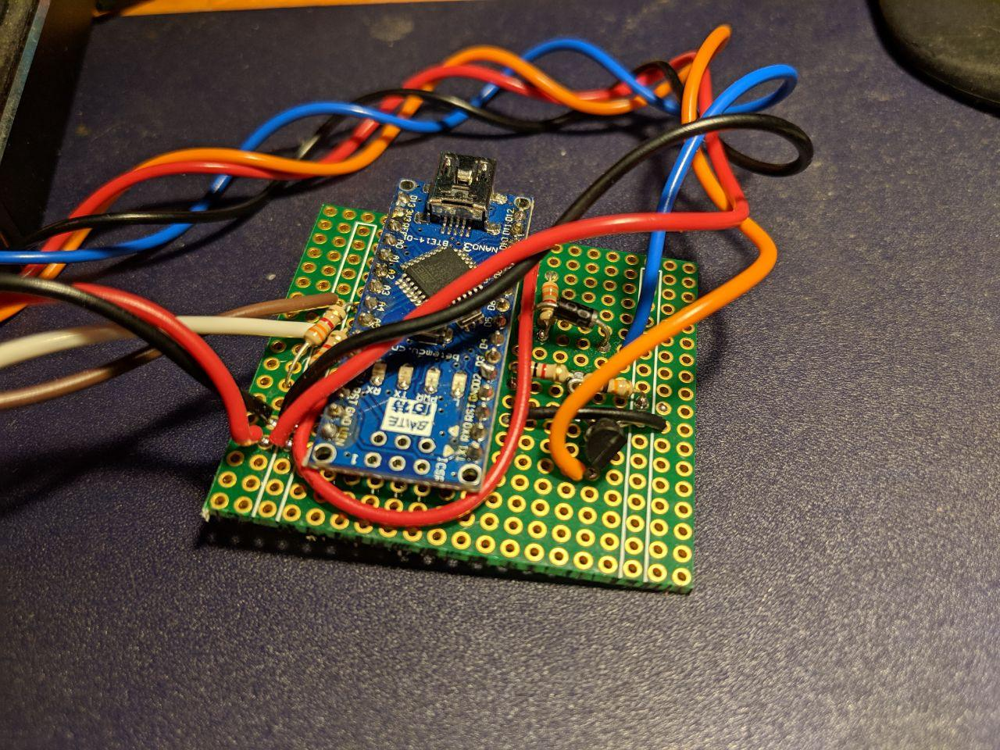

# IC-9350
Codan 9350/3040 to Icom IC-7000 and IC-706 interface circuit and software.

DO NOT connect a IC-706 or an IC-7000 directly to a 5V microcontroller! The Icom radios use open-collector logic, with the IO lines pulled high to 13.8V. This can fry your microcontroller!

Included in this repository is a schematic showing how to handle the level conversions and drive the inputs appropriately.

Notes for VK3FUR build:
  - BAS16 replaced with 1N4001 diode
  - BC847 replaced with 2N2222
  - IC1 replaced with Arduino Nano (no need for R1, C1, X1, IC1, R2, IC2)
  - Arduino Connections:
      What was PB2 becomes D6
               PA7 becomes D3
               PA3 becomes A3
               PA1 becomes A5
               12v is inputed to VIN

https://crcit.net/c/1ec5415c

Some Notes:
  * You can find instructions on how to build in the source file
  * code can be build in the latest 1.8.5 environment
  * doc directory contains schematic, simple enough to build on vero board
  * Refer to the comment block at the top of Icom9350.ino for more information, including wiring info.

TODO
----
* Create PCB gerbers
